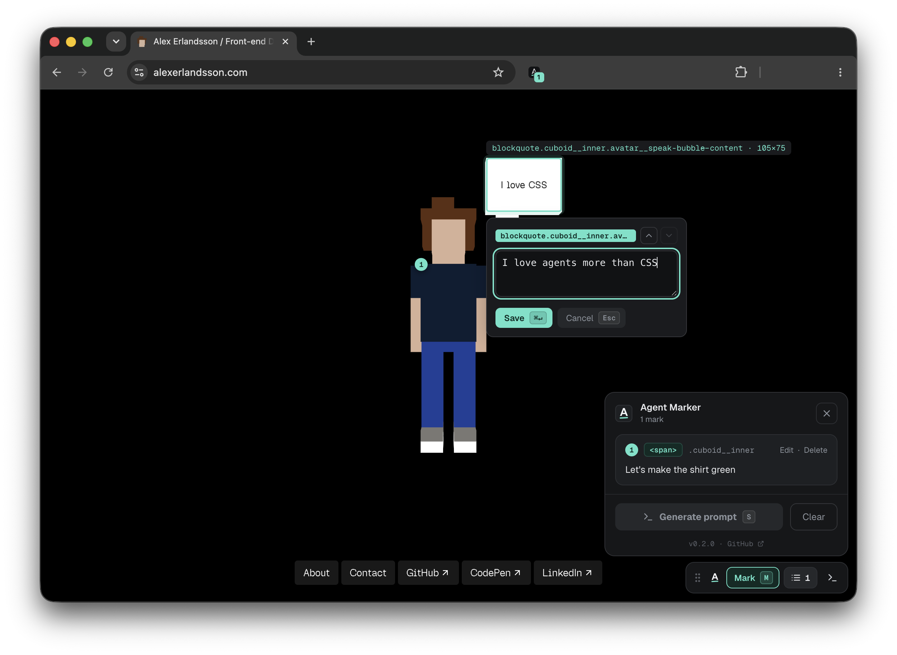

  

<h1 align="center">Agent Marker</h1>

  <strong>Mark elements on any web page, note what should change, and hand the whole batch
  to your AI coding agent as a ready-to-paste prompt.</strong>

---

  

Stop typing "the button in the header on the pricing page" over and over. Agent
Marker lets you **click the elements you want changed**, jot a one-line
instruction for each, and generate a single prompt that tells Claude Code
exactly what to change and where — complete with page URL and a CSS selector for
every mark. Mark across multiple pages in one go; send once.

## Install

1. Open `chrome://extensions` and enable **Developer mode** (top-right).
2. Click `Load unpacked` and select this folder.
3. Pin the extension, then click its toolbar icon to open the panel.

## Usage

1. **Open** — click the toolbar icon. A small floating pill appears in the
   bottom-right corner with marking armed (reopening a tab that already has
   marks shows the marks panel instead). Drag the pill anywhere; drop it near
   a corner and it snaps there (and stays there across resizes).
2. **Mark** — hover the page to highlight elements (<kbd>↑</kbd>/<kbd>↓</kbd>
   walk to the parent/child), then click (or press <kbd>↵</kbd>) to open a note.
3. **Describe** — type what should change (e.g. _"make this heading bigger"_)
   and **Save**. A numbered dot pins to the element, and the pill count ticks
   up. Repeat across as many pages as you like — marks follow the tab.
4. **Review** — click the count on the pill (or press <kbd>L</kbd>) to open the
   marks panel. Hover a card to highlight its element, click its number to
   scroll to it, edit or delete inline.
5. **Generate** — press <kbd>G</kbd> (or **Generate prompt** in the marks
   panel). The prompt is copied to your clipboard immediately and shown for
   review — just paste it into Claude Code.

Feedback that isn't about one element ("overall spacing feels cramped")? Press
<kbd>N</kbd> (or the sticky-note button on the pill) to add a **page note**.

### A11y audit

The pill shows the page's accessibility status: a teal check when the built-in
audit finds nothing, or a yellow triangle with the issue count. Click it (or
press <kbd>A</kbd>) to open the report — machine-checkable WCAG 2.1 checks
(missing alt text, unlabeled fields, nameless buttons, text contrast, heading
order, `lang`, zoom-blocking viewport, …) at level **AA** or **AAA** (toggle in
the report header; remembered across sessions). Add issues to your notes one
at a time (the **+** toggles to **✓**; click again to remove) or all at once —
they join the generated prompt tagged with their WCAG criterion so the agent
knows exactly what to fix. Automated checks cover
only part of WCAG; treat a green check as "nothing obvious", not "compliant".

Marks are **per tab** and last until the tab (or browser) closes — the toolbar
icon just hides the tool without losing anything, and its badge shows each
tab's mark count.

### Keyboard shortcuts

| Key            | Action                                        |
| -------------- | --------------------------------------------- |
| <kbd>M</kbd>   | Toggle marking                                 |
| <kbd>L</kbd>   | Toggle the marks panel                         |
| <kbd>G</kbd>   | Generate prompt (auto-copies to clipboard)     |
| <kbd>N</kbd>   | Add a page note                                |
| <kbd>A</kbd>   | Toggle the a11y audit panel                    |
| <kbd>↑</kbd> <kbd>↓</kbd> | While marking: walk to parent / back to child |
| <kbd>↵</kbd>   | While marking: mark the highlighted element    |
| <kbd>⌥</kbd> <kbd>↑</kbd> / <kbd>⌥</kbd> <kbd>↓</kbd> | In the note composer: retarget to parent / back |
| <kbd>⌘</kbd> <kbd>↵</kbd> | Save the current note              |
| <kbd>Esc</kbd> | Close the topmost thing (note → dialog → marking → panel) |

## What the agent receives

Each mark contributes its page title and URL, a CSS selector, the element
(tag / id / classes + a text snippet), its verbatim HTML opening tag, the
nearest labelled section it sits in, the viewport size, and your instruction —
grouped by page. Page notes are listed alongside, flagged as applying to the
whole page, and marks added from the a11y audit carry their WCAG criterion.
That's enough for Claude Code to locate the code and make the change without
any extra context from you.
